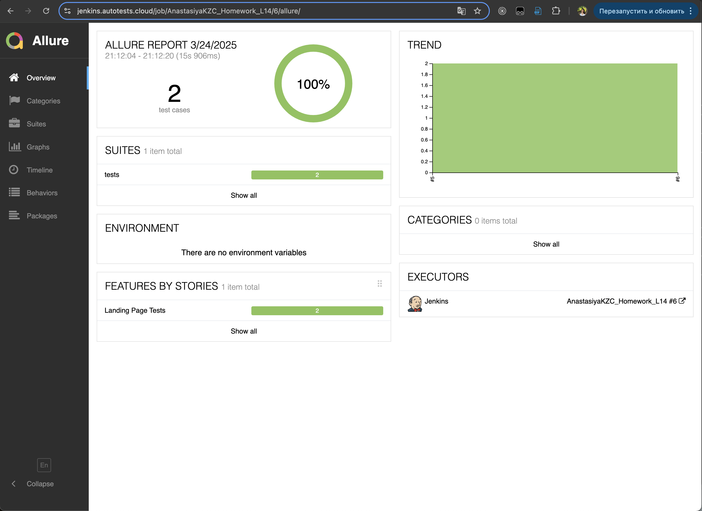

<p align="left">
  

- [Ссылка на занятие](https://school.qa.guru/pl/teach/control/lesson/view?id=334954973&editMode=0) 
- [Ссылка на лекцию](https://github.com/qa-guru/knowledge-base/wiki#python)
- [Ссылка на дженкинс лекции](https://jenkins.autotests.cloud/login?from=%2Fjob%2Fteacher-iTerkin-qa_guru_python_8_full_project%2F0) 


# Доделать! - ссылка на дженкинс, аллюр-отчет, телеграмм бот

## Проект UI автотестов "it.arda.digital"
> <a target="_blank" href="https://it.arda.digital/">Ссылка на страницу ИТ-кластера</a>
<p align="center">
  
</p>

### Список проверок, реализованных в автотестах
- [x] Лендинг. Открытие страницы - наличие кнопки формы регистрации
- [x] Лендинг. Переход на https://arda.digital/
- [x] Авторизация. Успешная авторизация (разлогиниться в после прохождения теста)
- [x] Авторизация. Неверный логин
- [x] Авторизация. Неверный пароль


## Проект реализован с использованием
<p align="center">
  
  
  
  
  
  
  
  
  
  
</p>

## Установка
```sh
pip install -r requirements.txt  # Установка зависимостей
```

## Запуск тестов
```sh
pytest  # Запуск всех тестов в проекте
```

### Основные ключи `pytest`:
- `-v` (verbose) — подробный вывод результатов тестирования.
- `-s` (show output) — показывает `print` внутри тестов.
- `--maxfail=N` — завершает тестирование после `N` неудачных тестов.
- `-k 'substring'` — запускает только тесты, содержащие `substring` в названии.
- `--tb=short` — сокращенный вывод трейсбека ошибок.

##  Запуск проекта в Jenkins
[Job](https://jenkins.autotests.cloud/job/UI_demoqa_qa_guru_python_2/)

При нажатии на "Собрать сейчас" начнется сборка тестов и их прохождение через виртуальную машину в Selenide.


##  Allure report
После прохождения тестов, результаты можно посмотреть в Allure отчете, где также содержится ссылка на Jenkins.


Во вкладке Graphs можно посмотреть графики о прохождении тестов, по их приоритезации, по времени прохождения и др.


Во вкладке Suites находятся собранные тест-кейсы, у которых описаны шаги и приложены логи, скриншот и видео о прохождении теста.


Видео прохождения теста:


##  Интеграция с Allure TestOps
[Dashboard](https://allure.autotests.cloud/project/1720/dashboards)

Так же вся отчетность сохраняется в Allure TestOps, где строятся аналогичные графики.


Во вкладке со сьютами, мы можем:
- Управлять всеми тест-кейсами или с каждым отдельно
- Перезапускать каждый тест отдельно от всех тестов
- Настроить интеграцию с Jira
- Добавлять ручные тесты и т.д.


##  Интеграция с Telegram
После прохождения тестов, в Telegram bot приходит сообщение с графиком и небольшой информацией о тестах.

